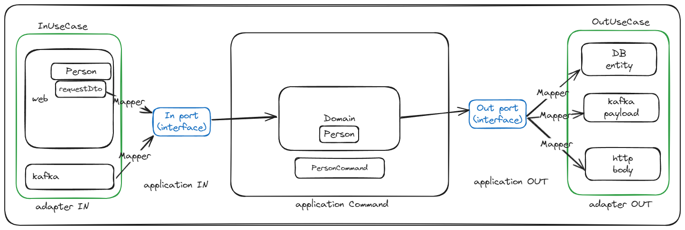

# begin

## 0. 개요
글로벌 소스를 하나의 소스코드로 배포해야한다. 각 국가마다 비즈니스 로직, 서드파티, 심지어 API도 모두 다르다.
이를 위해 각 국가별로 소스코드를 분리하지만, 공통의 API, 비즈니스로직등이 있다면 이들을 최대한 재사용해 중복 구현을 피한다.

## 1. 아키텍쳐 그림

### 1) Adapter
   1) adapter.in
      - `adapter.in` 패키지는 외부에서 들어오는 요청을 처리하는 패키지이다.
      - HTTP, GRPC, Kafka 등 외부에서 들어오는 요청을 처리하는 부분이다.
   ```
   ComPersonInUseCase
   ```
   2) adapter.out 
      - `adapter.out` 패키지는 외부로 나가는 응답을 처리하는 패키지이다.
   ```
   
   ```
   3) 
### Application
### 3) Domain
### 4) Infrastructure

## 세부사항 
### 1. abstract class를 왜 사용하였는가?
    - 기존의 인터페이스를 사용하면, 모든 메소드를 구현해야한다. 이는 불필요한 코드를 작성하게 된다.
    - abstract class를 사용하면, 필요한 메소드만 구현하면 된다. 또한 abstract class는 일반 메소드도 구현할 수 있어, 공통의 로직을 구현할 수 있다.
    - 따라서 abstract class를 사용하면, 불필요한 코드를 줄일 수 있고, 공통의 로직을 재사용할 수 있다.
    - protected 접근제어자를 사용하면, 상속받은 클래스에서만 접근할 수 있어, 캡슐화를 보장할 수 있다.
### 2. 국가별로 어떻게 분리하였는가?
    - 국가별로 소스코드를 분리하기 위해, 패키지를 생성하였다. 단, 공통의 로직 혹은 API라면 com(common:공용) 패키지에 생성하였다.
    - 예를 돕기 위해 [@KRBean](https://github.com/seonghoJoo/begin/blob/main/src/main/java/com/shj/begin/infrastructure/common/KRBean.java) 어노테이션을 만들었다. 이 어노테이션을 사용하면, KRBean이 붙은 클래스는 한국에 배포될때, 빈등록이 되게 해놨다.
    - 내부적으로 Kubernetes ConfigMap을 사용하였다. (EX) profile : kr-stg. 이를 통해, application-kr-stg.yaml이 로드되어, 한국에 배포될때, 해당 프로퍼티를 사용할 수 있다.
### 3. 어떻게 공통의 API를 재사용하였는가?
    - 1)의 abstract 클래스를 상속받은 class들에게 실질적으로 빈등록이 될수있도록 @RestConrtoller, @Service, @Component를 등록하였다. application.yaml에서 county 속성에 따라 일치하면 해당 class가 Bean 등록이 되도록하였다.
